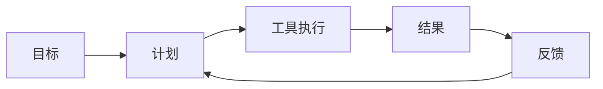
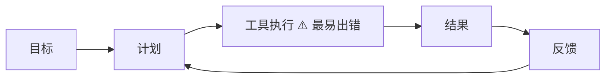

# 第01章：智能体是什么，不是什么

很多人第一次接触智能体，会把它理解成“更聪明的聊天机器人”。  
这个理解不完全错，但不够工程化。

如果用生活类比，聊天助手像“问答客服”，你问它答；  
而智能体更像“能执行任务的实习生”，你给目标，它会自己拆解任务、选择工具、执行动作、再把结果交回来。

这就是二者最大的区别：  
**聊天助手重在回答，智能体重在完成任务。**

---

## 1. 智能体的最小闭环

一个能落地的智能体，至少要有下面 5 个环节：

1. 接收目标：用户希望完成什么  
2. 制定计划：先做什么、后做什么  
3. 调用工具：读文件、执行命令、搜索内容  
4. 产出结果：输出代码、结论、变更  
5. 接收反馈：根据失败或新信息继续调整

可以把它理解为“做事循环”，而不是“对话循环”。

---

## 2. 为什么工程里必须强调“工具”

如果模型只能说不能做，它给出的建议再好，也要人手工执行。  
一旦接入工具，模型才能真正推进任务，比如：

- 读取仓库文件
- 执行构建命令
- 运行测试
- 修改代码

所以从工程视角看，智能体不是“大模型 + 提示词”，而是：  
**大模型 + 运行时 + 工具系统 + 安全策略。**

---

## 3. 在 claw-code 里的对应关系

你正在学习的 `claw-code` 项目，就是一个命令行智能体运行系统：

- 命令行层：接收用户输入
- 运行时层：组织智能体执行流程
- 工具层：真正执行动作
- 模型接入层：与外部模型服务通信

它的价值不在“回答像不像人”，而在“执行是否稳定、可控、可复现”。

---

## 4. 常见误区

### 误区一：提示词写得好就够了

提示词很重要，但没有工具和权限机制，智能体无法稳定落地。

### 误区二：能跑一次就算完成

工程要求可复现。今天能跑、明天也能跑，换台机器也能跑，才算真正完成。

### 误区三：智能体就是自动化脚本

脚本一般是固定流程；智能体是“在约束下动态决策”，更灵活，也更需要治理。

---

## 5. 本章小结

- 智能体的关键不是“会聊天”，而是“会执行并闭环”
- 工程化智能体一定包含工具与规则
- 你后续学习要始终围绕“闭环能力”判断一个系统是否成熟

---

## 6. 本章练习（阅读后完成）

1. 用不超过 150 字解释“智能体与聊天助手的差异”。  
2. 画出你理解的智能体闭环图，并标出“最容易出错”的环节。  
3. 回答：如果没有工具系统，智能体能力会退化成什么样？

---

## 7. 练习参考答案

### 答案 1：智能体与聊天助手的差异（≤150 字）

聊天助手以“对话”为核心，用户提问、模型回答，交互在文本层面闭合。智能体以“任务完成”为核心，它能接收目标、自主拆解计划、调用工具执行动作（读文件、跑命令、改代码等），并根据执行结果做反馈调整，形成“计划 → 执行 → 反馈”的做事闭环。关键区别在于：聊天助手只输出建议，智能体能真正推进任务落地，其背后需要运行时、工具系统和安全策略的工程支撑。

### 答案 2：智能体闭环图及最容易出错的环节

**最容易出错的环节：工具执行。** 原因有三：

1. **环境不确定性** — 文件不存在、命令执行失败、权限不足等运行时异常在此环节集中爆发。
2. **副作用不可逆** — 计划阶段的错误可以重新规划，但工具执行一旦写错文件、删除内容，可能造成实际损害。
3. **模型意图与工具行为的错配** — 模型“以为”调用工具会做 A，但实际参数拼错或理解偏差导致做了 B，这类错误往往在结果返回后才被发现。

因此工程化智能体需要在工具执行层做好沙箱隔离、权限控制和幂等性设计。

### 答案 3：如果没有工具系统，智能体会退化成什么？

如果移除工具系统，智能体会退化为一个**纯文本聊天助手**。具体表现为：

- **只能建议，无法执行** — 它可以告诉你“应该修改第 42 行代码”，但无法真正打开文件、修改、保存。
- **闭环断裂** — “计划 → 执行 → 反馈”的循环在“执行”处断开，变成“计划 → 输出文本”的单向流，无法自主验证结果。
- **丧失可复现性** — 所有动作依赖人工手动执行，每次执行结果受人为因素影响，无法保证一致性。
- **与自动化脚本的差异消失** — 没有工具调用能力，智能体的“动态决策”优势无处施展，本质上退回到“一个会写长回答的问答系统”。

一句话总结：工具系统是智能体从“会说”到“会做”的分界线，没有它，agent 就不是 agent。

