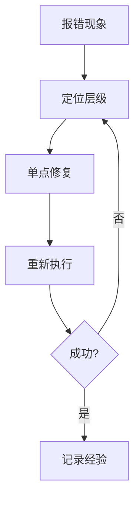

# 第02章：先跑通工程，再谈高级能力

初学者常见问题是：一上来就想学优化、学架构、学高级玩法。  
但工程学习的第一原则是：**先让系统跑起来。**

可以把这件事类比成开餐馆：  
你先确保水电、灶台、食材供应都正常，再谈菜品创新。  
如果基础设施不稳定，所有“高级技巧”都只是空中楼阁。

---

## 1. 为什么“跑通”是第一里程碑

跑通意味着三件事已经成立：

- 你的环境没问题（工具链可用）
- 你的依赖没问题（构建可完成）
- 你的执行链路没问题（命令可触发核心流程）

在 `claw-code` 中，建议至少完成：

1. 构建成功  
2. 测试可执行  
3. 一条真实请求能返回结果

---

## 2. 工程验证的三层结构

推荐把验证分成三层：

### 第一层：构建验证

确认代码能被编译、依赖能被解析。

### 第二层：测试验证

确认关键行为没有明显破坏。

### 第三层：运行验证

确认实际执行链路可用（输入 -> 推理 -> 输出）。

这三层像楼房地基、承重墙和电路系统，缺一不可。

---

## 3. 常见问题与排查方法

### 常见问题

- 工具链版本不匹配
- 凭据或环境变量缺失
- 命令执行目录错误

### 四步排障法

1. 记录现象：保留完整报错  
2. 归类层级：工具链/配置/网络/权限  
3. 单点修复：一次只改一个变量  
4. 复验闭环：回到原命令验证

---

## 4. 在本项目中的实践建议

你可以把“跑通清单”固定下来，每次换机器都先走一遍：

- 构建
- 测试
- 一条简单 prompt
- 一条结构化输出 prompt

这样你会形成自己的“工程开机仪式”，大幅减少后续排障成本。

---

## 5. 常见误区

### 误区一：只要 build 成功就够了

不够。build 只能证明编译通过，不能证明行为正确。

### 误区二：测试失败先跳过

短期省时间，长期会堆风险，最后返工成本更高。

### 误区三：报错看不懂就复制粘贴找答案

可以参考答案，但必须建立“报错分层思维”，否则永远靠运气。

---

## 6. 本章小结

- 先跑通，是工程学习的起点，不是终点
- 构建、测试、运行三层验证必须打齐
- 排障能力是智能体工程师的核心竞争力之一

---

## 7. 本章练习（阅读后完成）

1. 写出你自己的“三层验证清单”。  
2. 复盘一个你遇到的错误，按四步法写成 8 行以内记录。  
3. 回答：为什么“单点修复”比“同时改很多设置”更可靠？

