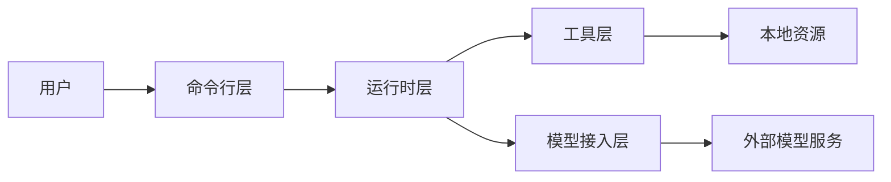
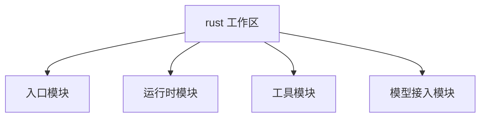
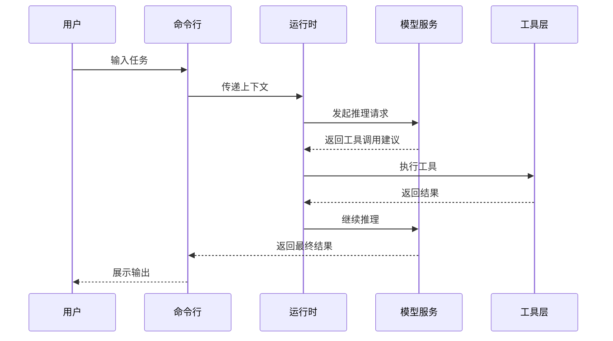
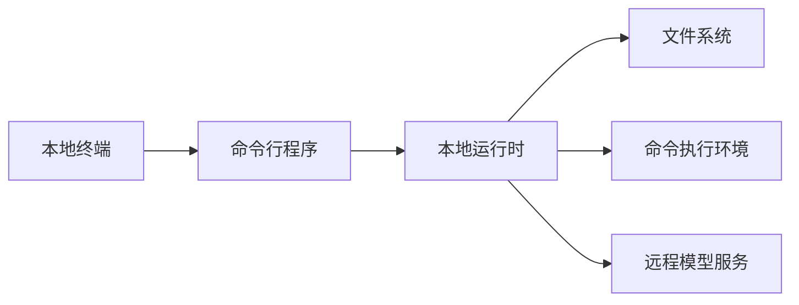

# 第03章：项目架构总览（用 4+1 视图看懂系统）

很多人读项目时会陷入一个误区：  
先打开一个大文件，然后越看越乱，最后什么都没记住。

更有效的方法是先建立“地图感”。  
在架构学习中，推荐使用 4+1 视图：  
**逻辑视图、开发视图、进程视图、物理视图、场景视图**。

你可以把它理解成“看一座城市的五张地图”，每张图解决一个问题。

---

## 1. 逻辑视图：系统由哪些角色组成

逻辑视图关注“谁负责什么”。

在 `claw-code` 里你可以先记住四层：

- 命令行层：收任务
- 运行时层：编排流程
- 工具层：执行动作
- 模型接入层：连通模型服务

---

## 2. 开发视图：代码如何组织

开发视图关注“代码怎么摆放，模块怎么协作”。

这张图的价值是：  
你以后改功能时，先定位“该改哪一层”，而不是全仓库乱搜。

---

## 3. 进程与场景视图：一次请求怎么走

场景视图关注“真实业务流程如何穿过系统”。

这条链路说明：  
智能体不是“一次请求一次回答”，而是可能发生多轮“推理-执行-再推理”。

---

## 4. 物理视图：系统部署关系

物理视图关注“系统跑在哪、依赖哪些外部组件”。

这张图尤其适合定位“环境问题”和“连通性问题”。

---

## 5. 为什么 4+1 对初学者很有用

- 防止你陷入文件细节泥潭
- 帮你建立“从上到下”的理解路径
- 后续写简历和面试讲解时，能结构化表达

一句话总结：  
**先有全局地图，再做局部施工。**

---

## 6. 本章小结

- 4+1 视图是架构学习的“认路系统”
- 你需要能把“图示”和“代码目录”一一映射
- 看懂一次请求的完整链路，是后续调试和优化的基础

---

## 7. 本章练习（阅读后完成）

1. 画出你自己的 4+1 视图简版（每张图不超过 6 个节点）。  
2. 选一个节点（如运行时层），写出它最重要的 3 个职责。  
3. 回答：如果工具层挂了，用户会看到什么现象？

