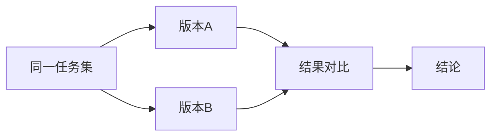

# 第04章：系统提示词设计（从“会说话”到“会按规矩做事”）

很多初学者把提示词当“灵感文案”，想到什么写什么。  
在工程场景里，这样很危险。

系统提示词更像“操作规程”或“岗位制度”：  
它要告诉智能体什么能做、什么不能做、失败时怎么办、结果怎么输出。  
换句话说，提示词不是装饰，而是执行规则。

---

## 1. 三层输入边界：规则、需求、结果

在一个完整智能体系统中，至少有三类信息源：

- 系统规则：长期约束与行为边界
- 用户需求：本次任务目标
- 工具结果：客观执行反馈

如果这三层混在一起，系统就容易跑偏、越权或前后矛盾。

```mermaid
flowchart TD
  sys["系统规则"] --> runtime["运行时"]
  user["用户需求"] --> runtime
  runtime --> call["工具调用"]
  call --> result["工具结果"]
  result --> runtime
  runtime --> output["最终输出"]
```

---

## 2. 一个实用的结构化提示词框架

你可以用下面 5 段式框架组织系统提示词：

1. 角色与目标：你是谁，主要任务是什么  
2. 约束与禁令：哪些事情不能做  
3. 执行策略：优先顺序和操作原则  
4. 失败处理：遇到错误如何上报和回退  
5. 输出规范：结果格式、简洁度、可验证性

这个框架的好处是：  
它把“行为边界”写死，把“执行策略”写清，把“输出标准”写稳。

---

## 3. 在 claw-code 里的对应点

你可以重点关注 `runtime/src/prompt.rs` 中的提示词组装思路：

- 如何拼装静态规则
- 如何注入动态上下文
- 如何处理项目级指令文件

这些设计共同决定了：  
同样一个用户输入，系统会如何理解并采取什么动作。

---

## 4. 为什么提示词调优要做实验

“感觉更好”不等于“真的更好”。  
调优提示词必须做小型对照实验。

最小实验流程：

1. 选定同一批任务  
2. 准备两个提示词版本  
3. 固定模型和环境变量  
4. 对比结果质量与稳定性  
5. 记录结论与下一步假设



---

## 5. 常见误区

### 误区一：提示词越长越好

错误。过长会稀释重点，还可能引入冲突指令。

### 误区二：只写“要做什么”，不写“不能做什么”

缺少禁令会导致越权风险，尤其在命令执行场景。

### 误区三：看一次成功就下结论

工程要看稳定性，至少要做多任务、多轮次验证。

---

## 6. 本章小结

- 系统提示词是“规则层”，不是“文案层”
- 三层输入边界清晰，系统才稳定
- 调优必须实验化，结论必须可复验

---

## 7. 本章练习（阅读后完成）

1. 写一版你自己的 5 段式系统提示词框架。  
2. 设计两个“坏提示词”例子并说明风险。  
3. 选 3 个任务，对两版提示词做一次小对照，并写 5 行结论。

