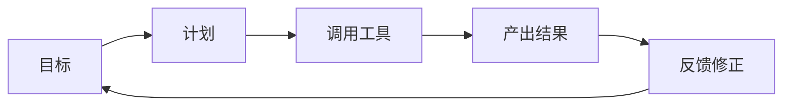

# 第01章：智能体是什么，不是什么（授课稿）

## 一、课程信息

- 建议时长：75 分钟
- 适合人群：零基础学员
- 本章目标：
  - 能用一句话解释“智能体”和“聊天助手”的区别
  - 理解智能体的最小工作闭环
  - 建立后续学习的统一语言体系

## 二、课前准备

- 打开课程总纲：`learning/agent-course/course-outline-and-chapters.md`
- 准备白板或笔记工具（用于画流程图）

## 三、授课流程（讲师时间轴）

## 0-10 分钟：破冰与生活类比

### 讲师话术参考

“今天你先不要把智能体想得很玄。把它想成一个新来的实习生。  
如果你只跟他说‘帮我写代码’，他可能会写得乱七八糟。  
但如果你告诉他目标、给他工具、定好规则、让他汇报，他就会越做越稳。  
这就是智能体工程。”

### 板书关键词

- 目标
- 工具
- 规则
- 反馈

## 10-30 分钟：核心概念讲解

### 内容 1：聊天助手 vs 智能体

- 聊天助手：以“回答”为主
- 智能体：以“执行任务并闭环”为主

### 内容 2：智能体最小闭环

### 讲师提示

- 强调“闭环”这个词，后面每一章都会反复出现
- 让学生理解：没有工具调用就很难算工程化智能体

## 30-50 分钟：结合本项目说明

### 讲解重点

- 这个项目不是只做对话，而是做“命令行智能体运行系统”
- 学员本课程不是学“提问技巧”，是学“系统搭建能力”

### 引导提问

1. 为什么同样是大模型，有的产品只是聊天，有的能改代码？
2. 工程里为什么要强调权限？

## 50-65 分钟：课堂练习

### 任务

1. 每位学员写 120-200 字：智能体定义。  
2. 用一句话区分聊天助手与智能体。  
3. 画一张“目标到反馈”的闭环图。

### 讲师巡回答疑点

- 定义是否包含“执行”而不是“回答”
- 流程图是否包含“反馈修正”

## 65-75 分钟：总结与作业

### 本章总结

- 智能体的本质是“可执行+可反馈”
- 工程学习的重点是“稳定可复现”

### 课后作业

- 文件：`learning/agent-course/homework/第01章.md`
- 内容：
  - 你的智能体定义
  - 你的闭环图
  - 你最困惑的 2 个问题

## 四、验收标准（助教用）

- 能否准确区分“回答型”与“执行型”
- 闭环图是否完整
- 文字表达是否清晰且不空泛

