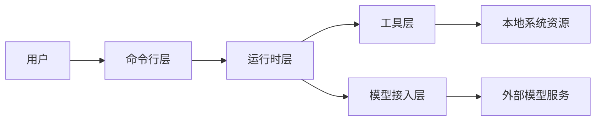
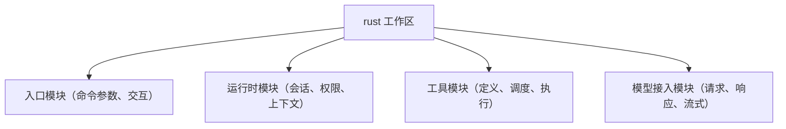
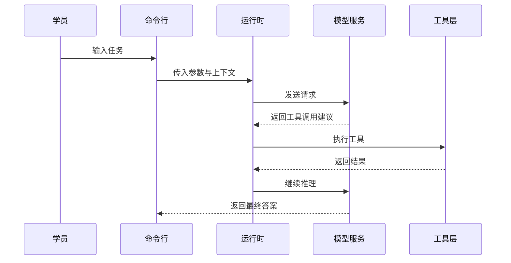
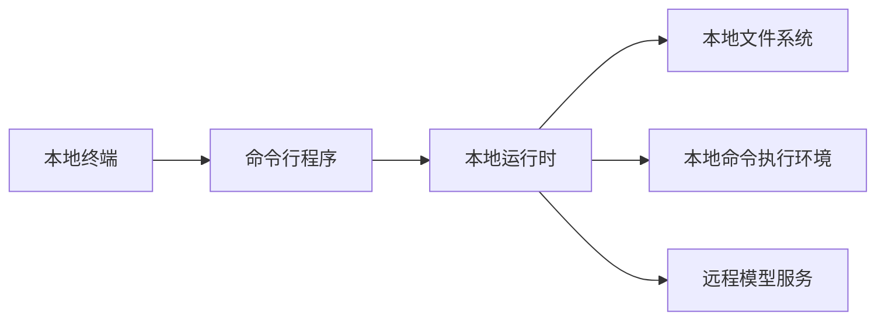

# 第03章：项目架构总览（4+1 视图）（授课稿）

## 一、课程信息

- 建议时长：100 分钟
- 本章目标：
  - 学员能用 4+1 视图描述系统架构
  - 学员能看懂一次请求的完整路径
  - 学员能将代码目录和架构角色对应起来

## 二、课前准备

- 打开总纲文件：`learning/agent-course/course-outline-and-chapters.md`
- 准备画图工具（Mermaid 或白板）

## 三、授课流程（讲师时间轴）

## 0-15 分钟：为什么要学 4+1 视图

### 讲师话术参考

“看架构就像看城市：  
你需要地铁图（流程）、行政区划图（模块）、建筑图（代码结构）、交通图（部署连接）。  
一张图解决不了所有问题，所以我们用 4+1 视图。”

## 15-35 分钟：逻辑视图（模块关系）

### 讲解要点

- 命令行层负责入口和交互
- 运行时层负责流程编排
- 工具层负责执行动作
- 模型接入层负责与外部模型通信

## 35-55 分钟：开发视图（代码组织）

### 讲解要点

- “模块职责清晰”比“文件数量少”更重要
- 后续改动要先找对模块，不要全局乱改

## 55-75 分钟：场景视图（请求时序）

### 讲解要点

- 一次请求可能包含多轮“模型-工具”往返
- 这也是智能体与普通聊天的关键差异

## 75-85 分钟：物理视图（部署关系）

## 85-100 分钟：课堂实操与总结

### 学员任务

1. 自己重画 4+1 视图（可简化）。  
2. 每张图写 3 句说明。  
3. 进行 3 分钟口头讲解。

### 本章总结

- 看架构不是背图，而是为了“定位问题、组织改动”
- 图示能力是面试和协作的高价值能力

### 课后作业

- 文件：`learning/agent-course/homework/第03章.md`
- 内容：
  - 4+1 图示
  - 每图说明
  - 讲解录音或讲稿

## 四、验收标准（助教用）

- 图示是否覆盖 4+1 五个维度
- 是否能将图示映射到代码模块
- 讲解是否逻辑清晰、术语准确

