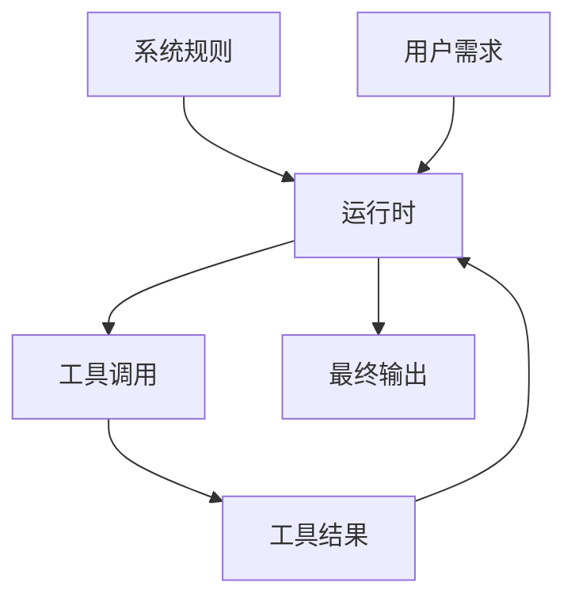

# 第04章：系统提示词设计（规则层）（授课稿）

## 一、课程信息

- 建议时长：90 分钟
- 本章目标：
  - 学员理解系统提示词、用户输入、工具结果三层边界
  - 学员掌握“提示词结构化设计”的基本方法
  - 学员能做小规模对照实验

## 二、课前准备

- 阅读：`runtime/src/prompt.rs`（讲师课前先做导读）
- 准备一份简单任务集（5-8 条）

## 三、授课流程（讲师时间轴）

## 0-15 分钟：生活类比

### 讲师话术参考

“系统提示词像公司的制度手册。  
用户输入像临时任务单。  
工具结果像现场反馈。  
制度、任务、反馈混在一起，执行就会乱；分层清楚，执行才稳。”

## 15-35 分钟：三层边界讲解

### 三层定义

- 系统层：长期规则、行为边界
- 用户层：当前目标、临时需求
- 工具层：客观执行结果

### 边界图

## 35-55 分钟：结构化提示词方法

### 模板框架（课堂示例）

1. 角色与目标  
2. 约束与禁止项  
3. 执行步骤建议  
4. 失败时处理策略  
5. 输出格式要求

### 讲师强调

- “写得长”不等于“写得好”
- 可执行、可验证、可复盘才是好提示词

## 55-75 分钟：小型对照实验

### 课堂实验

1. 版本 A：无结构提示词  
2. 版本 B：有结构提示词  
3. 对比：
  - 是否更稳定
  - 是否更少跑偏
  - 是否更容易复盘

### 实验记录模板

- 任务：
- 版本：
- 输出质量：
- 是否越权：
- 可改进点：

## 75-90 分钟：总结与作业

### 本章总结

- 提示词不是“魔法句子”，而是“执行制度”
- 结构化提示词可以明显提升稳定性

### 课后作业

- 文件：`learning/agent-course/homework/第04章.md`
- 内容：
  - 你的系统提示词模板
  - 两个失败案例
  - 一次 A/B 对照记录

## 四、验收标准（助教用）

- 是否能区分三层输入
- 提示词模板是否包含约束和失败处理
- 实验记录是否完整、可复现

