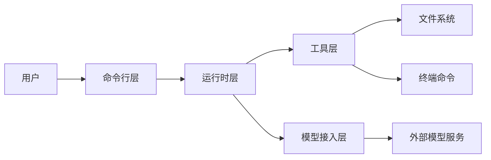
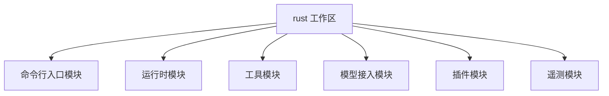
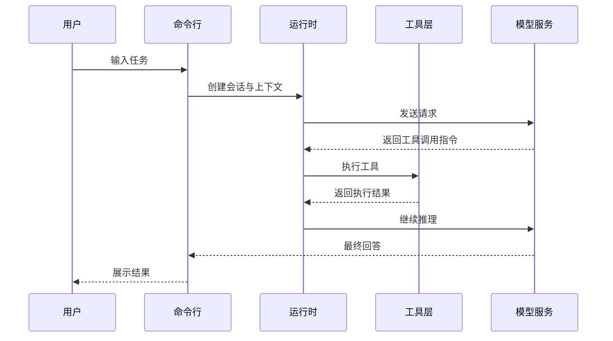
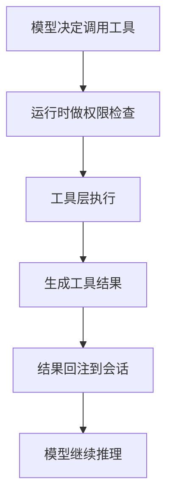
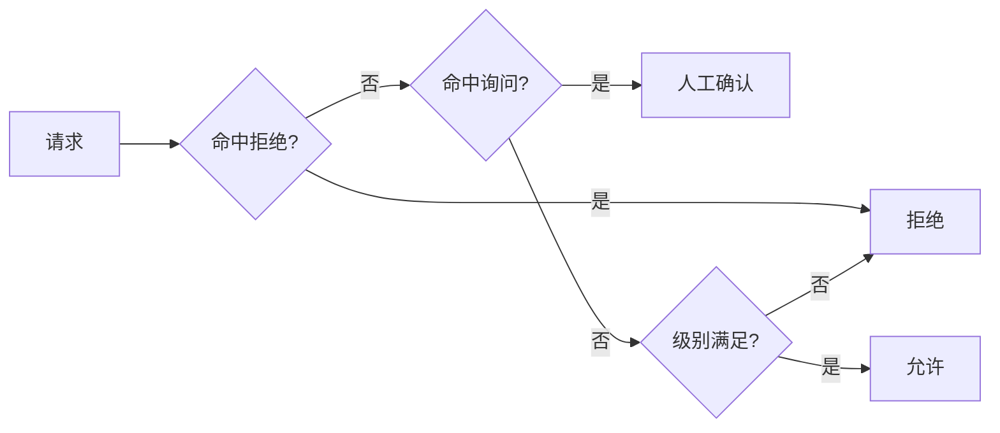
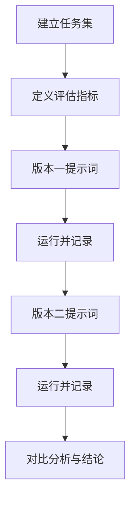
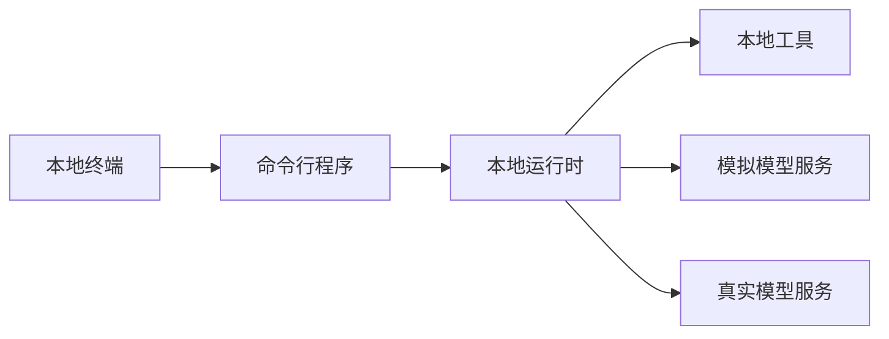

# 零基础智能体工程课程（基于 claw-code）

> 课程目标：让零基础学习者从“会用工具”走到“会搭建、会优化、会讲解智能体系统”。  
> 教学原则：全程中文、先类比再原理、先跑通再优化、每章都有任务与验收。

---

## 一、课程总设计

### 1. 课程定位

- 课程名称：零基础智能体工程实战课（命令行方向）
- 实战底座：`claw-code` 项目
- 核心能力：系统认知、工程实现、稳定性优化、求职表达

### 2. 学习成果

- 能独立复现项目并完成环境排障
- 能讲清核心架构并画出关键流程图
- 能完成至少一个改进点并给出前后数据
- 能输出可用于简历和面试的项目材料

### 3. 教学节奏

- 周期：6 周
- 章节：12 章
- 方式：讲解 + 实操 + 复盘 + 答辩

---

## 二、第 1 章：智能体是什么，不是什么

### 小节 1：生活类比

把智能体想成“会主动做事的实习生”：  
你给目标，它会找工具、做动作、交结果；而不只是陪聊。

### 小节 2：核心概念

- 智能体与聊天助手的差别
- 智能体闭环：目标、计划、执行、反馈
- 为什么工程化比“会提问”更重要

### 小节 3：课程任务

1. 写 200 字：你理解的“智能体”定义。  
2. 用一句话区分“聊天助手”和“智能体”。  
3. 画出目标到结果的闭环草图。

### 小节 4：验收标准

- 能解释“会执行”与“会回答”的区别
- 闭环图中包含目标、工具、反馈三个要素

---

## 三、第 2 章：先跑通工程，再谈高级能力

### 小节 1：生活类比

搭环境像搭厨房：厨具没装好，菜谱再好也做不出来。

### 小节 2：核心内容

- 构建、测试、健康检查三层验证
- 常见错误类型：工具链版本、认证、路径
- 排障的标准流程：现象、定位、修复、复验

### 小节 3：课程任务

1. 完成项目构建与测试。  
2. 记录至少 2 个错误案例。  
3. 写出你的排障清单。

### 小节 4：验收标准

- 有完整命令记录与结果记录
- 每个错误都有“原因与修复”闭环

---

## 四、第 3 章：项目架构总览（4+1 视图）

### 小节 1：生活类比

看项目像看城市：先看总图，再看道路，再看楼层，不要一上来就钻房间。

### 小节 2：4+1 视图方法介绍

- 逻辑视图：模块职责怎么分
- 开发视图：代码目录怎么组织
- 进程视图：运行时如何协作
- 物理视图：部署和外部依赖如何连接
- 场景视图：用户一次请求如何穿过系统

### 小节 3：逻辑视图（模块关系图）

### 小节 4：开发视图（代码结构图）

### 小节 5：场景视图（一次请求时序图）

### 小节 6：课程任务

1. 参考本章图示，画出你自己的 4+1 视图。  
2. 给每个视图写 3 句解说词。  
3. 录制 3 分钟讲解音频。

### 小节 7：验收标准

- 图与讲解能对应起来
- 能说明各视图解决了什么问题

---

## 五、第 4 章：系统提示词设计（规则层）

### 小节 1：生活类比

系统提示词像公司制度：制度清晰，执行统一；制度含糊，团队跑偏。

### 小节 2：核心内容

- 系统提示词、用户输入、工具输出的边界
- 上下文注入原则：必要、最小、可解释
- 截断与预算：保留什么、舍弃什么

### 小节 3：课程任务

1. 写出系统提示词结构清单。  
2. 设计两个容易误导模型的反例。  
3. 写一个改进版规则模板。

### 小节 4：验收标准

- 能解释为什么要分层提示
- 模板对“越权、幻觉、跑偏”有明确约束

---

## 六、第 5 章：工具系统（智能体的手脚）

### 小节 1：生活类比

大脑再聪明，没有手脚也搬不动东西。工具就是智能体的执行器官。

### 小节 2：核心内容

- 工具定义与工具执行的分层思想
- 文件类工具、命令类工具、检索类工具
- 工具结果回流后的二次决策

### 小节 3：执行流程图

### 小节 4：课程任务

1. 列出 10 个工具及其风险等级。  
2. 复盘 1 次工具调用链路。  
3. 分析 1 次失败调用并写改进建议。

### 小节 5：验收标准

- 能讲清“先检查再执行”的价值
- 能从失败日志中定位责任层

---

## 七、第 6 章：权限与安全策略（护栏层）

### 小节 1：生活类比

权限像驾照等级：路越复杂，要求越严格。

### 小节 2：核心内容

- 只读、工作区可写、完全访问三种模式
- 允许、拒绝、询问三类规则
- 最小权限原则与默认拒绝策略

### 小节 3：策略决策图

### 小节 4：课程任务

1. 制作权限能力矩阵。  
2. 设计 5 条拒绝规则和 3 条询问规则。  
3. 完成一次“拒绝到放行”的演示。

### 小节 5：验收标准

- 规则可执行、无冲突
- 能解释每条规则背后的风险假设

---

## 八、第 7 章：多模式工作流设计

### 小节 1：生活类比

一个人全干容易乱，分工协作更稳定。模式切换就是分工机制。

### 小节 2：核心内容

- 交互模式与一次性模式的使用边界
- 计划模式与执行模式切换时机
- 结构化输出在自动化里的作用

### 小节 3：课程任务

1. 设计一个“先计划后执行”的流程卡。  
2. 给出 3 个需要切换模式的真实场景。  
3. 形成《模式选择手册》第一版。

### 小节 4：验收标准

- 模式切换有明确触发条件
- 能减少无效重复操作

---

## 九、第 8 章：模型接入与环境配置

### 小节 1：生活类比

模型服务像供电系统：电压、电流、插头都对上，设备才稳定运行。

### 小节 2：核心内容

- 模型服务接入的通用步骤
- 密钥与地址配置常见错误
- 连通性验证与失败复验

### 小节 3：课程任务

1. 完成至少一种模型服务连通。  
2. 记录一次配置失败并修复。  
3. 输出《接入检查清单》。

### 小节 4：验收标准

- 能在新环境独立完成接入
- 有标准化检查步骤

---

## 十、第 9 章：提示词调优实验课

### 小节 1：生活类比

调优像做化学实验：不控制变量，就得不到可靠结论。

### 小节 2：核心内容

- 基线任务集设计方法
- 对照实验设计与记录
- 指标体系：成功率、耗时、调用次数、成本

### 小节 3：实验流程图

### 小节 4：课程任务

1. 建立 20 条基线任务。  
2. 做两轮对照实验。  
3. 形成调优报告并给出下一轮假设。

### 小节 5：验收标准

- 结论有数据支撑
- 指标与任务目标一致

---

## 十一、第 10 章：测试与一致性保障

### 小节 1：生活类比

测试像体检，稳定性像复查；一次正常不代表长期稳定。

### 小节 2：核心内容

- 工作区测试的分层价值
- 模拟服务与一致性验证
- 回归测试与风险控制

### 小节 3：部署与验证视图（4+1 的物理视图）

### 小节 4：课程任务

1. 跑通测试与一致性脚本。  
2. 解读 3 个场景结果。  
3. 给你的改动补 1 条测试。

### 小节 5：验收标准

- 能定位失败发生在哪一层
- 能证明改动没有破坏已有行为

---

## 十二、第 11 章：稳定性优化与性能优化

### 小节 1：生活类比

优化像给车做调校：目标不是炫技，而是更稳、更快、更省。

### 小节 2：核心内容

- 失败重试与回退策略
- 错误分类与可观测性
- 长会话下的稳定性策略

### 小节 3：优化闭环图

### 小节 4：课程任务

1. 选择一个优化点并实现。  
2. 给出优化前后指标对比。  
3. 写复盘，说明取舍与副作用。

### 小节 5：验收标准

- 至少一个指标显著改善
- 能解释收益与成本

---

## 十三、第 12 章：结业项目与商业化表达

### 小节 1：生活类比

项目是产品本体，简历是包装，面试是发布会。

### 小节 2：核心内容

- 项目叙事模板：背景、目标、方案、结果、复盘
- 指标化表达：让成果可被验证
- 面试讲解：三分钟讲清价值

### 小节 3：课程任务

1. 写中文简历项目描述。  
2. 准备三分钟项目讲稿。  
3. 完成一次结业路演答辩。

### 小节 4：验收标准

- 讲稿结构完整、证据充分
- 能回答“为什么这样设计”与“有什么代价”

---

## 十四、课程作业与交付规范

### 1. 作业命名

- `learning/agent-course/homework/第01章.md` 到 `第12章.md`

### 2. 每章作业固定结构

- 本章理解（不超过 300 字）
- 本章图示（至少 1 张）
- 本章实操（命令与结果）
- 本章问题（至少 2 条）
- 下章准备（行动清单）

### 3. 统一评分标准

- 40% 动手完成度
- 30% 工程理解度
- 20% 表达清晰度
- 10% 复盘改进能力

---

## 十五、课程运营建议（可对外售卖）

- 每章 60 至 90 分钟，讲解与实操比例约 4:6
- 每两章一次答辩，强化表达与复盘
- 每周一次优秀作业点评，形成学习氛围
- 结业采用路演制，直接输出求职作品包

